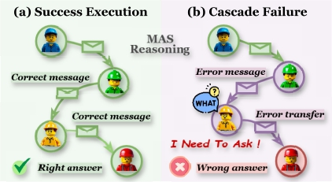
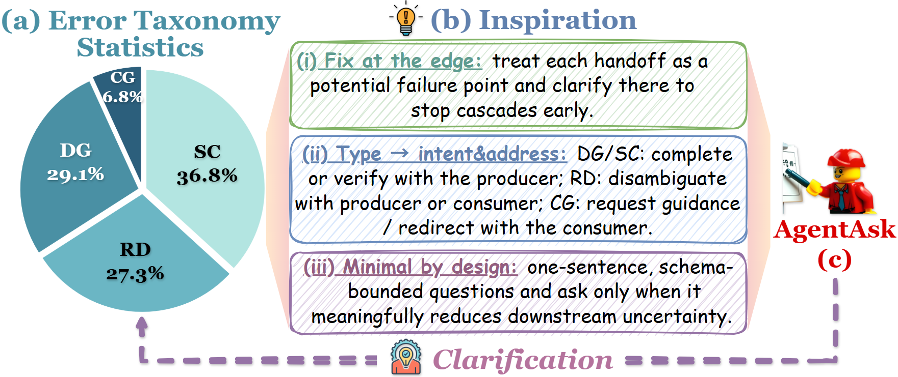
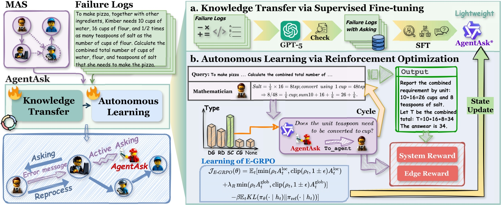

# AgentAsk: Multi-Agent Systems Need to Ask

##  ❓ Why AgentAsk?
AgentAsk brings **edge-level clarification** to multi-agent systems (MAS). It treats each inter-agent message as a potential failure point and inserts a **minimal necessary** question to prevent error cascades, improving reliability with low latency and cost.



##  Method Overview
AgentAsk is a lightweight, plug-and-play clarifier that:
* Detects edge-level issues which are based on our taxonomy: **Data Gap (DG)**, **Signal Corruption (SC)**, **Referential Drift (RD)**, **Capability Gap (CG)**.



* Decides **when/what/whom/how** to ask using a factored policy.
* Trains in two stages: **Supervised Fine-Tuning (SFT)** from failure traces and **E-GRPO** reinforcement for accuracy–latency–cost trade-offs.



##  🧭 Quick Start

###  🔑 Configure API keys
Add API keys in `template.env` and change its name to `.env`.
```bash
cp template.env .env
```

###  📦 Datasets
Please download `GSM8K`, `HumanEval`, `MATH`, `MBPP`, `MMLU` and place them in the `Datasets` folder
```bash
Datasets/
├─ gsm8k/         ── gsm8k.jsonl
├─ humaneval/     ── humaneval-py.jsonl
├─ MATH/          ── train/ , test/
├─ mbpp/          ── mbpp.jsonl
└─ MMLU/          ── data/
```

### 🎚️ Choose a running mode

AgentAsk exposes three base modes:
* none — original pipeline without clarification (baseline).
* llm — clarification by a large model (heavy but strong).
* student — clarification by our trained lightweight model.

If student and ClarifyManager.online_rl=True → training (online RL).
Otherwise → inference (no RL update).


###  🚀 run
After setting `.env`, start with any dataset runner.
IWhy AgentAsk?
AgentAsk brings **edge-level clarification** to multi-agent systems (MAS). It treats each inter-agent message as a potential failure point and inserts a **minimal necessary** question to prevent error cascades, improving reliability with low latency and cost.


##  Method Overview
AgentAsk is a lightweight, plug-and-play clarifier that:
* Detects edge-level issues which are based on our taxonomy: **Data Gap (DG)**, **Signal Corruption (SC)**, **Referential Drift (RD)**, **Capability Gap (CG)**.


* Decides **when/what/whom/how** to ask using a factored policy.
* Trains in two stages: **Supervised Fine-Tuning (SFT)** from failure traces and **E-GRPO** reinforcement for accuracy–latency–cost trade-offs.


##  🧭 Quick Start

###  🔑 Configure API keys
Add API keys in `template.env` and change its name to `.env`.
```bash
cp template.env .env
```

###  📦 Datasets
Please download `GSM8K`, `HumanEval`, `MATH`, `MBPP`, `MMLU` and place them in the `Datasets` folder
```bash
Datasets/
├─ gsm8k/         ── gsm8k.jsonl
├─ humaneval/     ── humaneval-py.jsonl
├─ MATH/          ── train/ , test/
├─ mbpp/          ── mbpp.jsonl
└─ MMLU/          ── data/
```

###  🚀 Run
After setting `.env`, start with any dataset runner.
If you have completed the above steps and want to start quickly, you can directly execute
```bash
python Experiments\run_xxx.py
```

### 🎚️ Train
AgentAsk exposes three base modes:
* none — original pipeline without clarification (baseline).
* llm — clarification by a large model (heavy but strong).
* student — clarification by our trained lightweight model.

If you want to train a model from scratch，first run the command for sft:
```bash
bash scripts\run_sft.sh
```

If student and ClarifyManager.online_rl=True, then we can training with online RL(Otherwise → inference).
Just edit the ClarifyManager and run:
```bash
python Experiments\run_xxx.py
```


